# Crypto Strategy Lab Architecture

**Status:** current architecture description

This document describes the system implemented in this repository. It is the traceability document for runtime
boundaries, domain ownership, asynchronous flows, failure behavior, scalability evidence, and reproducibility rules.
The domain vocabulary is defined in [`CONTEXT.md`](../CONTEXT.md); durable choices are recorded in [`docs/adr/`](adr/).

## System context

Crypto Strategy Lab evaluates strategies against historical market data. It does not place orders or move real money.
The browser is a client of the Backend and never talks to Binance, a news site, or an LLM vendor directly.

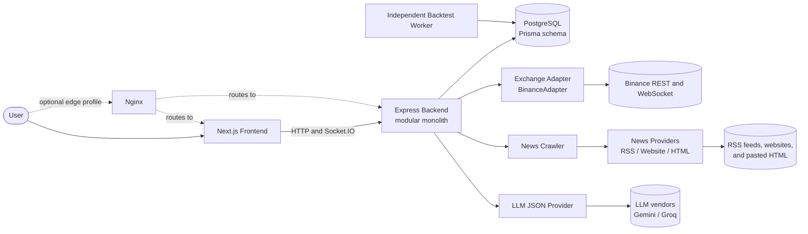

The system context has these boundaries:

| Boundary                    | Owns                                                                                                                                                                      | Does not own                                                                        |
| --------------------------- | ------------------------------------------------------------------------------------------------------------------------------------------------------------------------- | ----------------------------------------------------------------------------------- |
| Next.js Frontend            | Routes, feature UI, owner-scoped API calls, Socket.IO subscriptions, and neutral chart rendering                                                                          | Binance access, Strategy analysis, Backtesting, Evaluation, Ranking, or persistence |
| Express Backend             | HTTP controllers, authentication, modular-monolith application services, live market/news orchestration, Search coordination, Experiment preparation, and event consumers | Long-running Backtest execution; the Backtest Worker owns that process              |
| Backtest Worker             | Job claims, leases, version dispatch, simulation, Evaluation, result persistence, and completion facts                                                                    | HTTP, WebSocket clients, candidate generation, Ranking, or exchange access          |
| PostgreSQL                  | Users, Shared Data, User-owned data, immutable Dataset Snapshots, queue state, outbox state, and materialized Leaderboard projection                                      | Strategy logic and in-memory live stream windows                                    |
| Exchange Adapter            | Translation between an exchange protocol and normalized Candle, Tick, and price contracts                                                                                 | Market-data policy, chart rendering, and Strategy logic                             |
| News Provider               | Translation from one configured News Source into normalized NewsItems                                                                                                     | Sentiment scoring and storage of the result                                         |
| Optional Nginx edge profile | Single-origin local/deployment routing and WebSocket proxying                                                                                                             | A domain component; it is a deployment profile only                                 |

The primary dependency directions are:

```text
Frontend → Market Data Service → Exchange Adapter → Binance
Backend → News Crawler → News Provider → News Source
Backend → LLM JSON Provider → LLM vendor
Backtest Worker → PostgreSQL
Backtest Worker → transactional outbox → Backend Domain Event Bus → consumers
```

## Container and module view

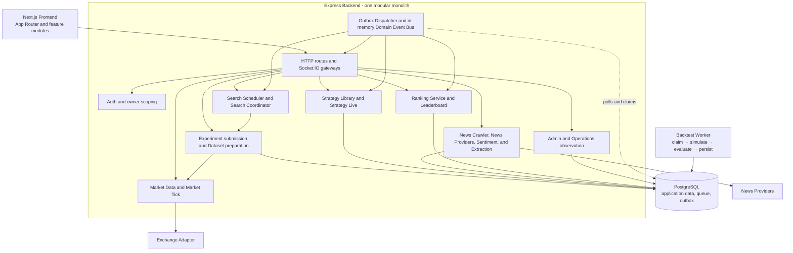

### Backend module responsibilities

| Module                           | Responsibility and seam                                                                                                                                                                                                                                                                | Durable ownership                                                                                    |
| -------------------------------- | -------------------------------------------------------------------------------------------------------------------------------------------------------------------------------------------------------------------------------------------------------------------------------------- | ---------------------------------------------------------------------------------------------------- |
| Market                           | `MarketDataService` owns live/history Candle state, stream recovery, normalization, closed-Candle persistence, and historical Dataset preparation. `MarketTickService` owns the bounded recent Tick window. Both depend on `ExchangeAdapter`.                                          | Candles are Shared Data; Ticks are intentionally in-memory only.                                     |
| Strategy                         | `StrategyRegistry` discovers Strategy plugins. `StrategyLiveService` supplies Context and publishes signals. Strategy Library services persist User entries and immutable Strategy Versions. `CombinationEngine` assembles Composite Strategies.                                       | Strategy Library entries and Strategy Versions are User-owned. Built-in registry entries are shared. |
| Experiment / Backtest submission | The Backtest Service resolves a target, validates Pair, Timeframe, applicability, risk inputs, and range, then creates the Experiment and PENDING Backtest Job atomically. Its preparation coordinator asks Market Data for a Dataset Snapshot.                                        | Experiment, Backtest Job, and Dataset Snapshot.                                                      |
| Search                           | `StrategyGeneratorRegistry` selects a versioned StrategyGenerator. `SearchCoordinator` creates candidates and Experiments; `SearchScheduler` chains bounded SearchRuns for active sessions.                                                                                            | SearchRun and its generated Experiments.                                                             |
| Evaluation                       | Backtest Worker selects a Backtester by Simulation Rules Version and an Evaluator by Evaluator Version. The two interfaces keep simulation separate from metric formulas.                                                                                                              | Trades and Experiment Metrics.                                                                       |
| Ranking / Leaderboard            | `RankingService` consumes `StrategyEvaluated`, keeps the User's Top-K projection, and emits `LeaderboardUpdated`. It does not run Backtests or recompute Score.                                                                                                                        | Leaderboard and LeaderboardEntry projection rows.                                                    |
| News / Sentiment                 | `NewsCrawler` invokes a registered NewsProvider and persists normalized NewsItems. The stateless `SentimentScoringService` consumes unscored items through a separate interface; its consumer-side repository persists Sentiment. Extraction Templates are a Website-provider concern. | NewsSource, NewsItem, Crawl Attempt, Template Version, and Sentiment fields.                         |
| Authentication                   | Session authentication establishes the User. owner-scoped middleware applies the same ownership check to every User-owned read and write. Role gates shared-infrastructure operations.                                                                                                 | User and Session.                                                                                    |
| Operations                       | The admin-only Operations Service reads queue counts, recent failures, worker heartbeats, outbox backlog/dead letters, and rolling latency/throughput metrics. It is read-only.                                                                                                        | ServiceHeartbeat; it does not mutate Jobs or outbox rows.                                            |
| Event delivery                   | The transactional outbox is the durable handoff. The dispatcher claims rows with expiring database claims and publishes to the in-memory Domain Event Bus. Consumers own idempotency.                                                                                                  | OutboxEvent and consumer receipts where needed.                                                      |

The Backend composition root is [`apps/backend/src/index.ts`](../apps/backend/src/index.ts). Feature routes are composed
under [`apps/backend/src/api/routes/v1/index.ts`](../apps/backend/src/api/routes/v1/index.ts). The Worker has its own
composition root and does not share a second Prisma schema; see [`apps/backtest-worker/README.md`](../apps/backtest-worker/README.md).

## Domain ownership and persistence

The terms in this table are deliberate. In particular, a configured News Source is not a News Provider, and a queue
unit is not an Experiment.

| Concept           | Owner and meaning                                                                                                                                                                                                                                 |
| ----------------- | ------------------------------------------------------------------------------------------------------------------------------------------------------------------------------------------------------------------------------------------------- |
| User-owned data   | A User owns Strategy Library entries, Strategy Versions, Experiments, Trades, SearchRuns, Backtest Jobs, and their private Leaderboard. Reads and writes are always owner-scoped.                                                                 |
| Shared Data       | Candles, NewsItems, Sentiments, News Sources, Extraction Templates, and built-in Strategy registry entries are shared. Role gates writes to shared infrastructure; ordinary Users do not see another User's private Strategy work.                |
| Record Kind       | `LIBRARY_ENTRY` is a curated Strategy Library record; `BACKTEST_TARGET` exists only to give an ad-hoc manual Backtest a Strategy Version; `SEARCH_CANDIDATE` is generated by a SearchRun. Only `LIBRARY_ENTRY` is listed in the Strategy Library. |
| Provenance        | `USER_PROMPT`, `WEB_IMPORT`, or `MANUAL` describes where Library parameters came from. It is not Record Kind and is not part of a Strategy Version.                                                                                               |
| News Provider     | A swappable adapter kind: RSS, Website with an Extraction Template, or HTML paste. It creates normalized NewsItems.                                                                                                                               |
| News Source       | One configured feed URL or site crawled by a News Provider. Its persisted `isActive` flag is the admin-controlled Enabled switch; source health is a separate derived Active value from Crawl Attempts.                                           |
| SearchRun         | One bounded search session that owns generation progress, seed, Stop Policy, and accepted candidate Experiments.                                                                                                                                  |
| Experiment        | One domain-level Evaluation of an immutable Strategy Version against a Dataset Snapshot and execution assumptions.                                                                                                                                |
| Backtest Job      | The queue-level request for a Backtest Worker to process one Experiment. It can be retried and leased; it is not the result itself.                                                                                                               |
| Leaderboard Entry | One row in a User's current Top-K projection pointing to a completed Experiment. The Experiment remains the durable result.                                                                                                                       |

## Stable extension seams

### Adding MACD

MACD remains isolated because a new plugin does three things only:

1. Implement the Strategy contract in its own strategy module: `analyze(Context): Signal`, `paramsSchema`, and
   `requiredHistory`.
2. Register the factory and its Strategy implementation version with the existing strategy registries.
3. Import the strategy module from the existing Strategy barrel so boot-time registration runs.

The Combination Engine sees a Strategy through the registry, the Backtester receives the assembled Strategy, the
Evaluator receives Trades, the Ranking Service receives evaluation facts, and the Frontend receives neutral signals or
metrics. None of those components gains a MACD branch. If MACD has a non-flat parameter grammar, it registers a
Strategy Editor through `StrategyEditorRegistry`; the existing default editor remains unchanged.

### Adding a StrategyGenerator

An algorithm implements `StrategyGenerator.generate(): CandidateStrategy` and registers a factory in
[`apps/backend/src/api/features/search/generators/registry.ts`](../apps/backend/src/api/features/search/generators/registry.ts).
The Search Coordinator persists the candidate's opaque fingerprint and provenance, creates the same Experiment and
Backtest Job shape, and then the existing Backtest Worker, Evaluator, Ranking Service, and Visualization consume it
without knowing whether it came from Random, Domain-guided, or Genetic search. The generator owns its seed and
generation ordinal; downstream components do not infer them.

Other seams follow the same rule:

- A new exchange adds an `ExchangeAdapter` and changes composition, not Frontend or Market Data Service code.
- A new news input adds a `NewsProvider` and registration, not Crawler-to-Sentiment coupling.
- A new simulation or metric rule registers a new version in the Worker's `BacktesterRegistry` or `EvaluatorRegistry`.
- A new chart vendor implements `FinancialChartRenderer`; it does not acquire Socket.IO, exchange, or Strategy
  dependencies.

## Runtime and data flows

### Realtime Market Data

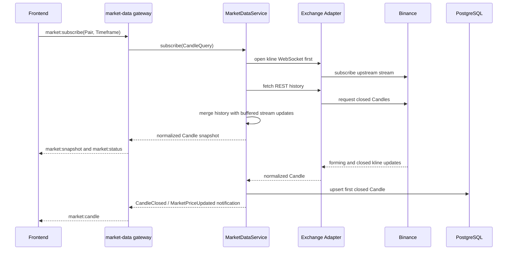

The service deduplicates by `(Pair, Timeframe, openTime)`, keeps a forming Candle in memory, and persists only after
close. A shared `market:<pair>:<timeframe>` room and reference-counted service state let multiple panels share one
upstream stream. The separate Market Tick path shares one trade stream per Pair and keeps only a bounded in-memory
window. The Frontend sees normalized contracts only; it never computes indicators or calls Binance.

### Strategy analysis and composition

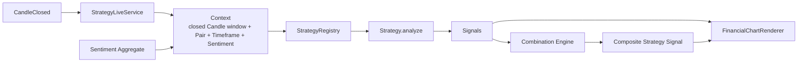

Each Strategy is called once per closed Candle using its own `requiredHistory`; it computes its own indicators from raw
Candles. The Strategy knows no database, exchange, chart, or notification code. The Combination Engine validates the
members and emits a Composite Strategy according to explicit `majority` or `weighted` rules. Strategy applicability is
validated before execution, not by turning a failed Strategy into HOLD.

### Manual Backtest

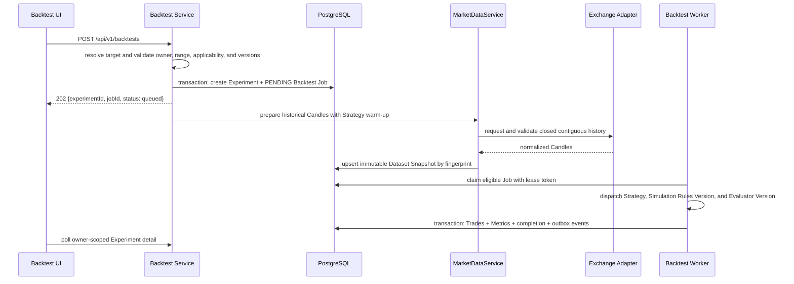

The request returns before historical preparation and simulation complete. The Worker consumes the exact Dataset
Snapshot attached by the Backend and never fetches Binance. Signals are evaluated on closed Candles, fills use the
versioned simulation rules, and the result retains transaction cost, slippage, Strategy Version, execution versions,
and build revision.

### Search to Backtest

```mermaid
flowchart LR
    control[Discovery UI] --> scheduler[Search Scheduler]
    scheduler --> run[bounded SearchRun\nStop Policy]
    run --> space[Search Space]
    space --> generator[StrategyGenerator]
    generator --> candidate[CandidateStrategy\nfingerprint + provenance]
    candidate --> validate[applicability and duplicate checks]
    validate --> atomic[one transaction\nStrategy Version + Experiment + Job]
    atomic --> worker[Backtest Worker]
    worker --> evaluated[StrategyEvaluated]
    evaluated --> coordinator[SearchCoordinator\nprogress and stop checks]
    coordinator --> run
```

`SearchCoordinator` captures the Dataset Snapshot before creating the SearchRun. It does not create a SearchRun if
preparation fails. Every accepted candidate records algorithm family, generator version, seed, generation ordinal,
candidate fingerprint, and SearchRun identity on its Experiment. A candidate cap, time budget, no-improvement streak,
consecutive-failure limit, or explicit user stop transitions the run to a terminal state. Backpressure waits when the
run reaches its in-flight limit.

The long-lived Search Scheduler chains runs, but each run terminates. In the implemented behavior, each active User
session has its own sequential chaining loop and its `maxInFlight` is clamped to the configured per-User cap (five by
default). PostgreSQL Job claiming remains a shared queue ordered by eligibility/creation time; there is no global
round-robin scheduler or guarantee of cross-User fairness. See [ADR-0007](adr/0007-continuous-discovery-via-search-scheduler.md).

### Event to Leaderboard projection

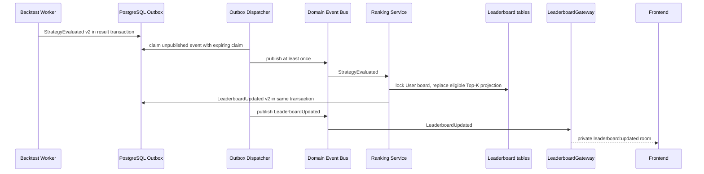

`StrategyEvaluated` carries the owner, Experiment and Strategy Version identities, singular/composite kind, display and
member snapshots, Pair, Timeframe, range, Score, and the persisted Evaluation metrics. Ranking does not synchronously
call the Worker or recompute the Score. Its consumer is idempotent by event receipt and unique board/Experiment
identity. The Top-K projection is recoverable through startup reconciliation from eligible completed Experiments.

### News to Sentiment

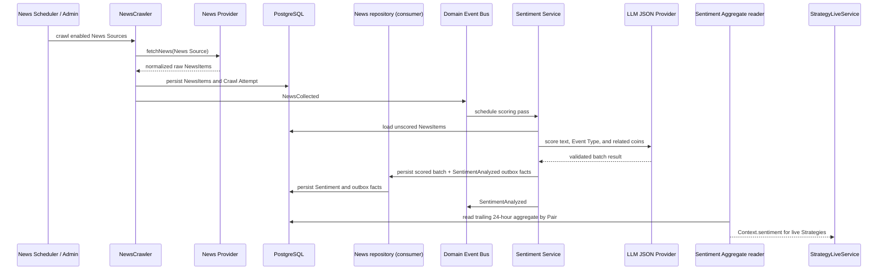

The Crawler depends on the `NewsProvider` abstraction only. RSS, Website, and HTML providers can be added or replaced
without changing Sentiment. The in-process Sentiment Service is stateless; persistence belongs to the consumer-side
repository. A Website provider applies a stored Extraction Template without calling the LLM during crawling.

### Initial exchange recovery

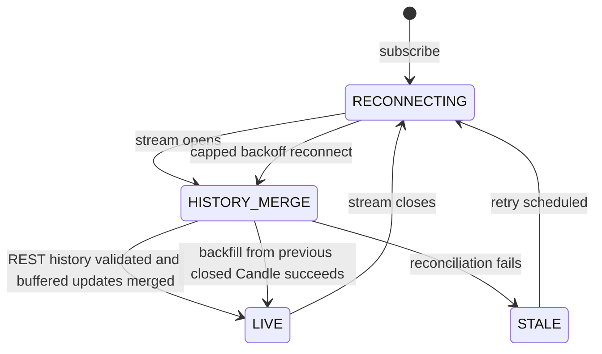

`HISTORY_MERGE` is an internal recovery phase. The public `ExchangeStreamStatus` contract exposes only `LIVE`,
`RECONNECTING`, and `STALE`.

The stream is opened before REST history so updates cannot be missed between the two operations. Recovery backfills
from the previous closed Candle minus one interval, merges buffered updates, and exposes `LIVE` only after the
reconciliation succeeds. Confirmed Candles remain available during failure; the service reports `STALE` instead of
inventing a bar. The same state model applies to the Tick stream, except Ticks are not persisted.

### Job retry and lease loss

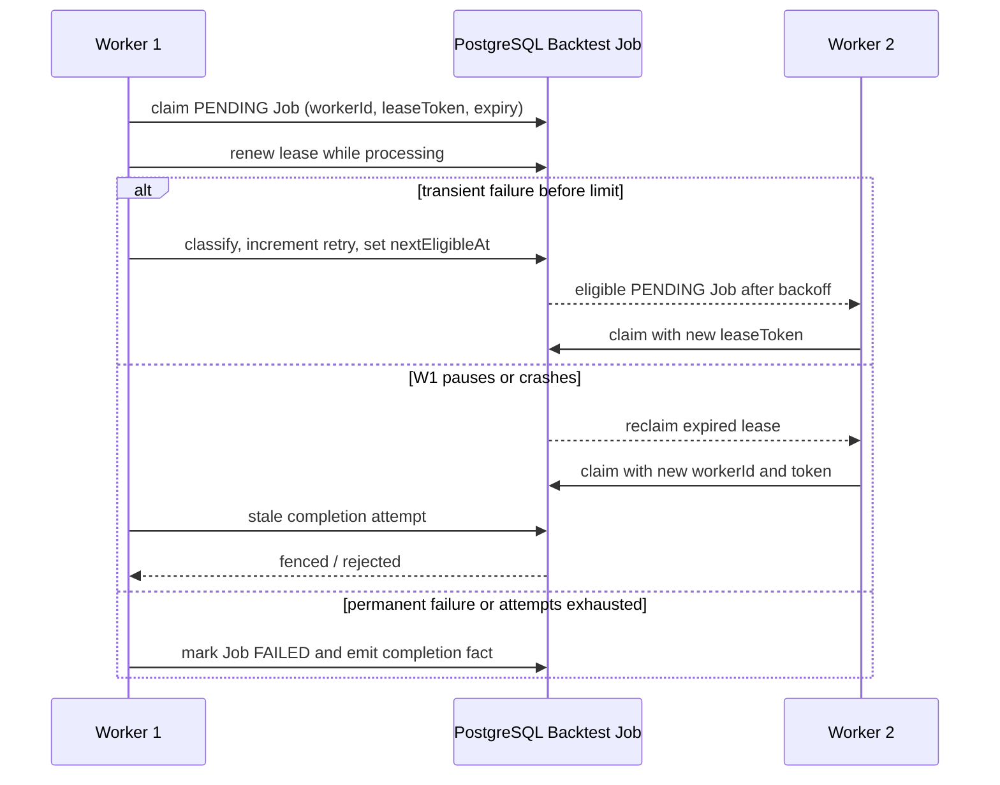

Claims require the current Worker ID, lease token, claimed status, and unexpired lease. Result persistence and
completion facts are accepted only with the current claim. Transient failures use bounded exponential backoff; the
current Job implementation permits four failed attempts/claims before terminal failure. Permanent failures terminate
immediately. A stale Worker cannot create duplicate Trades, Metrics, or completion events.

### Outbox redelivery and dead letter

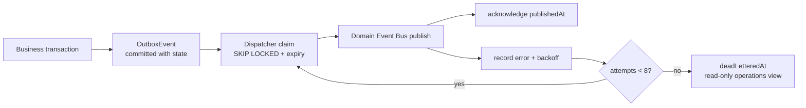

Outbox delivery is at least once and unordered. A crash after publishing but before acknowledgement causes redelivery;
consumers must deduplicate by event ID and must not depend on global event order. Decode, publish, and consumer-facing
failures are persisted with bounded backoff and jitter. After eight failed delivery attempts the event is dead-lettered
in place and remains available for administrator inspection and recovery. A poison event does not stop independent
events from progressing.

### Administrator observation

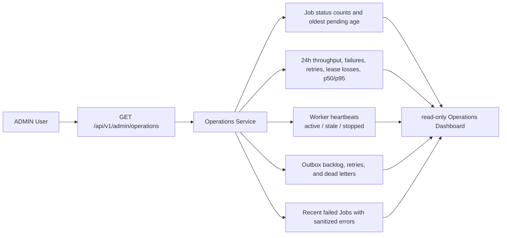

The Operations endpoint is role-gated to `ADMIN`, exposes no mutation controls, and sanitizes credentials/tokens from
error summaries. Worker and Backend heartbeats provide process health; queue and outbox metrics provide work health.
The dashboard is the observation surface for retry storms, lease loss, stale Workers, queue growth, and dead letters.

## Experiment provenance and reproducibility

The provenance chain is explicit. A Leaderboard Entry points to the exact Experiment that earned it; it does not
replace that Experiment or point to a mutable "current strategy".

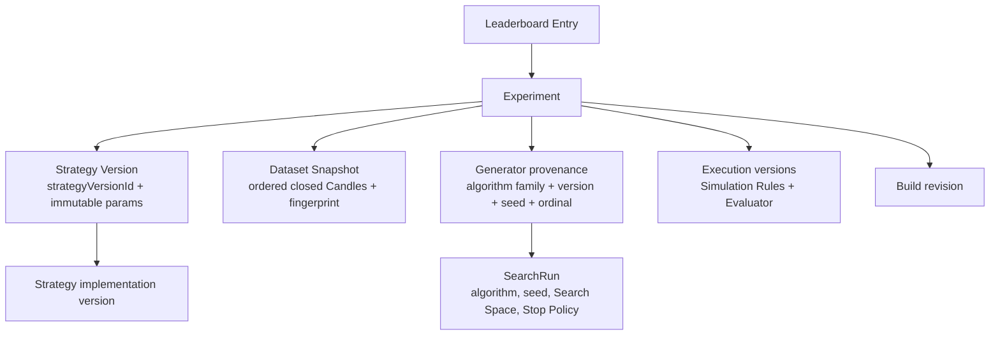

Every new Experiment records or resolves these facts:

| Provenance fact                    | Persisted source                                                                                                                                                   |
| ---------------------------------- | ------------------------------------------------------------------------------------------------------------------------------------------------------------------ |
| Strategy identity and parameters   | `Experiment.strategyVersionId` → `StrategyVersion.params`; the Strategy Version is immutable and its identity is deterministic from resolved parameters.           |
| Strategy implementation            | `Experiment.strategyImplementationVersion`; a composite includes the Combination Engine version and sorted member implementation versions.                         |
| Historical input                   | `Experiment.datasetSnapshotId` → immutable `DatasetSnapshot.fingerprint`, ordered Candles, Pair, Timeframe, range, and warm-up count.                              |
| Search origin                      | `Experiment.searchRunId` plus `generatorAlgorithm`, `generatorVersion`, `generatorSeed`, and `generationOrdinal`. Manual Experiments have no generator provenance. |
| Simulation and Evaluation behavior | `Experiment.simulationRulesVersion` and `Experiment.evaluatorVersion`, dispatched by Worker registries.                                                            |
| Application build                  | `Experiment.buildRevision`, compared with the Worker build before execution.                                                                                       |
| Input assumptions                  | Pair, Timeframe, range, initial investment, transaction cost, and slippage on the Experiment.                                                                      |

The API exposes this chain as `BacktestResultResponse.provenance`, including `reproducible`. A legacy Experiment with
missing version metadata is reported as not fully reproducible. A recorded but unavailable Strategy implementation,
Simulation Rules Version, Evaluator Version, or Build revision is rejected by the Worker; it is never silently replaced
with whatever version happens to be current. The same rule applies when restoring a SearchRun: the persisted algorithm
ID and seed recreate the generator from its next generation ordinal, or the run fails rather than changing its search
sequence.

The implementation is exercised by [`searchProvenanceTrace.test.ts`](../apps/backend/tests/features/search/integration/searchProvenanceTrace.test.ts),
[`implementationVersion.test.ts`](../packages/strategy-engine/tests/implementationVersion.test.ts), and the Worker
version/lease tests under [`apps/backtest-worker/tests`](../apps/backtest-worker/tests/).

## Infrastructure decisions and scaling evidence

### PostgreSQL queue, Redis cache, and BullMQ

The current decision is **PostgreSQL queue, no Redis, and no BullMQ**. The queue driver is the `backtest_jobs` table;
Workers use `SELECT ... FOR UPDATE SKIP LOCKED`-based claims with lease fencing. Redis and BullMQ are deliberately not
domain components and should not be introduced without the measurements below.

| Choice                     | Driver                                                                                 | Benefit                                                                                                     | Consequence                                                                                                                                       | Measurable revisit trigger                                                                                                                                                                       |
| -------------------------- | -------------------------------------------------------------------------------------- | ----------------------------------------------------------------------------------------------------------- | ------------------------------------------------------------------------------------------------------------------------------------------------- | ------------------------------------------------------------------------------------------------------------------------------------------------------------------------------------------------ |
| PostgreSQL queue (current) | `BacktestJob` rows, database claims, `nextEligibleAt`, and lease columns               | One durable store makes Experiment/Job/outbox transactions local and keeps retry and provenance inspectable | Polling and claim contention consume database work; queue throughput is bounded by PostgreSQL connections and query latency                       | Revisit when the 100,000-job campaign records queue-wait p95 above 1,000 ms or adding Workers from two to four improves throughput by less than 1.5× while PostgreSQL connections are saturated. |
| Redis cache (not used)     | No Redis deployment; Market Data uses bounded in-memory windows and PostgreSQL history | Could reduce repeated hot Candle/news reads and lower database read latency                                 | Adds cache invalidation, freshness, memory sizing, and another failure mode; it does not solve durable Job/Experiment transactions                | Add a cache only if a measured dashboard load test shows the same history/Aggregate reads exceed 50% of Backend database reads and PostgreSQL read p95 exceeds 200 ms for that workload.         |
| BullMQ (not used)          | No BullMQ/Redis driver; the Postgres Job Queue owns scheduling and retries             | Could provide mature queue concurrency, delayed Jobs, and queue telemetry                                   | Splits Job state from the Experiment transaction and requires Redis operations; outbox and lease semantics would need a second consistency design | Reconsider if the 100,000-job results show the PostgreSQL queue threshold above, after query/index/connection tuning fails to restore p95 and scaling.                                           |

### Nginx edge profile

Nginx is an optional Compose `edge` profile at `docker/nginx/edge.conf`. It routes `/` to the edge-configured
Next.js container and `/api/*` plus `/socket.io/*` to Express, including WebSocket upgrades. Direct Frontend and
Backend ports remain the default local profile. Nginx is a deployment/topology choice, not a Market, News, or
Authentication component and does not change the domain model.

### 100,000-job benchmark

The benchmark is an operational experiment, not a CI test. It creates disposable synthetic Users, a Strategy Version,
one Dataset Snapshot, 100,000 Experiments and Jobs, processes them, records database/queue metrics, and cleans up by
default. Run it against the local PostgreSQL instance after migrations:

```bash
pnpm --filter @crypto-strategy-lab/backtest-worker benchmark -- --jobs 100000 --workers 1 --allow-benchmark
pnpm --filter @crypto-strategy-lab/backtest-worker benchmark -- --jobs 100000 --workers 2 --allow-benchmark
pnpm --filter @crypto-strategy-lab/backtest-worker benchmark -- --jobs 100000 --workers 4 --allow-benchmark
```

Keep the machine, PostgreSQL configuration, dataset shape, batch size, and cleanup policy constant across the three
runs. Record one row per Worker count using the benchmark's human report fields:

| Workers |    Jobs | Completed | Failed | Lost | Duplicates | Retries | Wall time (s) | Throughput (jobs/s) | Queue p95 (ms) | Execution p95 (ms) | Peak PostgreSQL connections | Machine context               |
| ------: | ------: | --------: | -----: | ---: | ---------: | ------: | ------------: | ------------------: | -------------: | -----------------: | --------------------------: | ----------------------------- |
|       1 | 100,000 |         — |      — |    — |          — |       — |             — |                   — |              — |                  — |                           — | record CPU, cores, and memory |
|       2 | 100,000 |         — |      — |    — |          — |       — |             — |                   — |              — |                  — |                           — | same host                     |
|       4 | 100,000 |         — |      — |    — |          — |       — |             — |                   — |              — |                  — |                           — | same host                     |

CI remains limited to small correctness and concurrency checks. The relevant checks cover scaled claim selection,
benchmark smoke behavior, lease fencing, retries, outbox concurrency/dead letters, and provenance. A full campaign is
too slow and too resource-intensive to be a reliable per-commit gate.

## Demo path

The README contains the exact install, run, port, and direct manual-Backtest steps. A complete demo follows this order:

1. Start the host or Compose stack and open the Frontend. Confirm the Socket.IO connection and up to four independent
   BTCUSDT timeframe panels reach `LIVE`; interrupt the exchange stream and observe `RECONNECTING`/`STALE` recovery.
2. Open Strategy Engine, select registered Strategies, inspect signal overlays, and assemble a Composite Strategy.
   Add or tune a Strategy Version through the Strategy Library; the UI never executes the Strategy locally.
3. Submit a manual Backtest, watch the queued Experiment, inspect the Dataset fingerprint, metrics, Trades, and entry/
   exit markers, then open the private Leaderboard.
4. Open Discovery, start a bounded session, observe candidate/in-flight progress and a terminal Stop Reason, and
   inspect the SearchRun history and resulting Leaderboard entries.
5. Open News, crawl enabled Sources, inspect normalized NewsItems and Sentiment Aggregate, then open the admin-only
   Extraction/Operations surfaces when using an `ADMIN` account.

The corresponding client routes are `/`, `/strategy-engine`, `/backtests`, `/backtests/:experimentId`, `/discovery`,
`/news`, and `/admin/operations`. The detailed feature-specific notes are in [`apps/frontend/README.md`](../apps/frontend/README.md),
[`apps/backend/README.md`](../apps/backend/README.md), and [`apps/backtest-worker/README.md`](../apps/backtest-worker/README.md).

## Verification map

| Architectural claim                                       | Representative verification                                                                                                                                                                                                                                                                                                                |
| --------------------------------------------------------- | ------------------------------------------------------------------------------------------------------------------------------------------------------------------------------------------------------------------------------------------------------------------------------------------------------------------------------------------ |
| Exchange and market recovery seam                         | [`marketDataService.test.ts`](../apps/backend/tests/features/marketData/unit/marketDataService.test.ts), [`historicalCandlePreparation.test.ts`](../apps/backend/tests/features/marketData/unit/historicalCandlePreparation.test.ts)                                                                                                       |
| Strategy plugin and composition                           | [`registry.test.ts`](../packages/strategy-engine/tests/registry.test.ts), [`combinationEngine.test.ts`](../packages/strategy-engine/tests/combinationEngine.test.ts), [`strategyLiveService.test.ts`](../apps/backend/tests/features/strategies/unit/strategyLiveService.test.ts)                                                          |
| Search boundedness, generator restoration, and provenance | [`searchCoordinator.test.ts`](../apps/backend/tests/features/search/unit/searchCoordinator.test.ts), [`searchScheduler.test.ts`](../apps/backend/tests/features/search/unit/searchScheduler.test.ts), [`searchProvenanceTrace.test.ts`](../apps/backend/tests/features/search/integration/searchProvenanceTrace.test.ts)                   |
| Job claims, retries, leases, and scaling                  | [`PostgresJobQueue.test.ts`](../apps/backtest-worker/tests/integration/PostgresJobQueue.test.ts), [`BacktestJobLifecycle.test.ts`](../apps/backtest-worker/tests/integration/BacktestJobLifecycle.test.ts), [`scaledClaim.test.ts`](../apps/backtest-worker/tests/integration/scaledClaim.test.ts)                                         |
| Outbox delivery and Leaderboard projection                | [`outboxDispatcher.test.ts`](../apps/backend/tests/features/backtests/integration/outboxDispatcher.test.ts), [`leaderboardPersistence.test.ts`](../apps/backend/tests/features/leaderboard/integration/leaderboardPersistence.test.ts), [`rankingService.test.ts`](../apps/backend/tests/features/leaderboard/unit/rankingService.test.ts) |
| News, extraction, and Sentiment boundaries                | [`newsCrawler.test.ts`](../apps/backend/tests/features/news/unit/newsCrawler.test.ts), [`websiteProvider.test.ts`](../apps/backend/tests/features/news/unit/websiteProvider.test.ts), [`sentimentScoringService.test.ts`](../apps/backend/tests/features/news/unit/sentimentScoringService.test.ts)                                        |
| Administrator observation                                 | [`operationsRoutes.test.ts`](../apps/backend/tests/features/admin/integration/operationsRoutes.test.ts), [`operationsService.test.ts`](../apps/backend/tests/features/admin/unit/operationsService.test.ts)                                                                                                                                |
